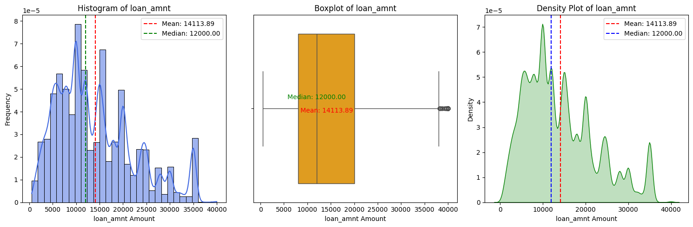
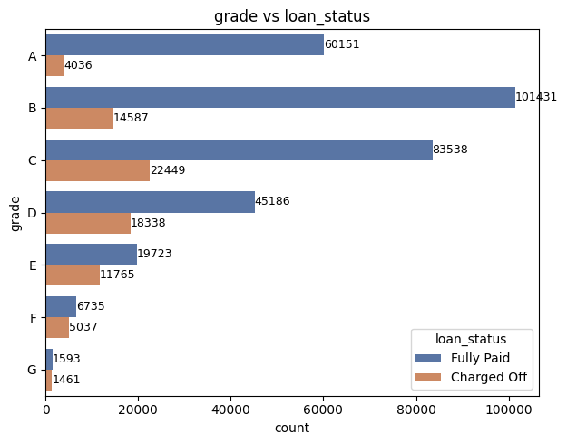
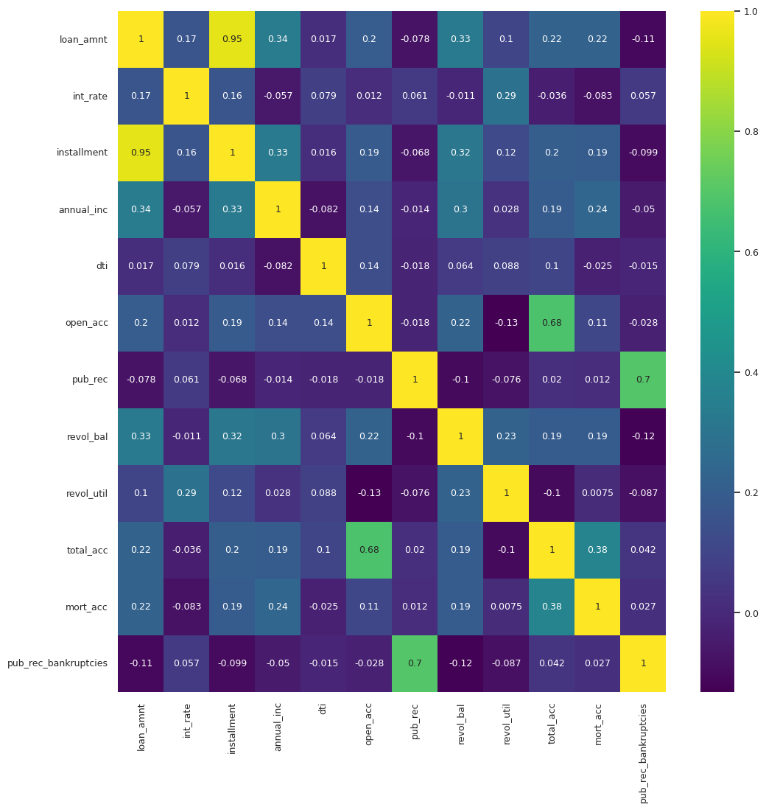
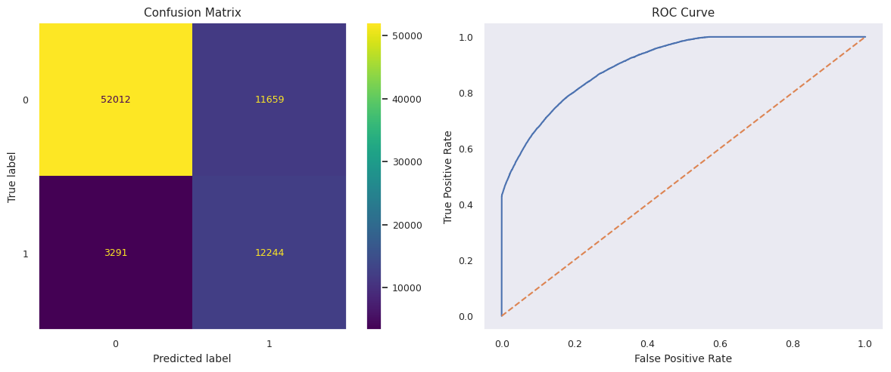
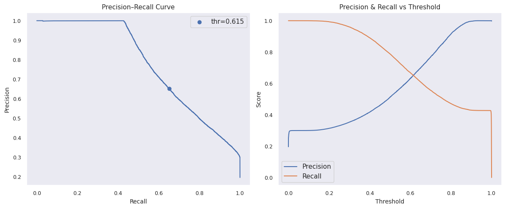
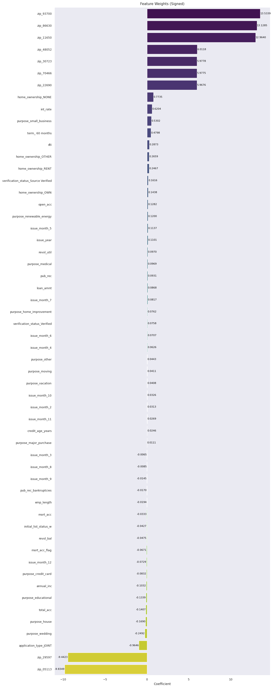

## 🚀 Run on Google Colab

## 📊 View on Kaggle

---

# LoanTap — Loan Default Prediction (Logistic Regression)

## 📌 Business Problem
LoanTap is a digital lending platform that extends instant, flexible credit products to salaried professionals and businesses. Given an applicant's profile, the underwriting team needs to decide whether to extend a credit line and, if so, on what terms — while balancing two competing risks:

- **Approving a risky borrower** → higher NPAs (non-performing assets) and credit losses.
- **Rejecting a safe borrower** → missed interest income and lost business.

This project builds a **binary classification model** (`1 = Charged Off / Default`, `0 = Fully Paid`) to predict loan default risk and support that trade-off with data.

---

## 🗂 Dataset
- **396,030 rows × 27 columns**, no duplicate records.
- One row per loan application, covering:
  - Loan terms — amount, term, interest rate, installment, grade/sub-grade
  - Borrower profile — employment length/title, home ownership, annual income, verification status
  - Credit history — DTI, open accounts, revolving balance/utilization, public records, bankruptcies, mortgage accounts
  - Target — `loan_status` (Fully Paid vs. Charged Off/Default)
- Class imbalance: **~80.4% fully paid vs. ~19.6% charged off/default.**

---

## ⚙️ Workflow

1. **EDA & column-by-column profiling** — distribution, outlier, and null analysis for all 27 features, with an explicit encoding/scaling decision recorded for each (e.g. `installment` dropped for multicollinearity with `loan_amnt`/`term`, verified via VIF).
2. **Missingness handled as signal** — e.g. null `emp_length` is imputed as its own `"Missing"` category rather than dropped, since missingness itself can correlate with default risk.
3. **Encoding** — ordinal encoding for naturally ranked features (`grade`, `sub_grade`, `emp_length`), one-hot encoding for nominal features (`term`, `home_ownership`, `purpose`, `verification_status`, etc.), robust/standard scaling for skewed numeric features.
4. **Train/test split**, followed by a second VIF pass on the encoded design matrix to drop remaining collinear features.
5. **Model iterations**, evaluated on accuracy, precision, recall, F1, MCC, ROC AUC and PR AUC (accuracy and ROC AUC alone are misleading here due to class imbalance):
   - Baseline logistic regression with manual `class_weight`
   - `GridSearchCV`-tuned `class_weight`
   - L1-regularized logistic regression (multicollinearity control + feature selection)
   - SMOTE-resampled training data, with and without L1 regularization
6. **Business translation** — coefficients converted into borrower-facing recommendations (risk-based approval tiers, DTI/utilization guardrails, smaller-loan offers for borderline applicants).

---

## 📊 Exploratory Data Analysis

**Loan amount** is right-skewed with ~191 outliers above $38,000 — treated as high-value (not erroneous) loans and handled with robust scaling rather than removal:

**Loan grade** is ordinal (A → G, low → high risk) and strongly predictive of repayment: applicants graded `A` fully pay their loans ~93.7% of the time, with the fully-paid rate falling steadily through to grade `G`:

**Feature correlations** confirm `loan_amnt` and `installment` are highly correlated (Pearson ≈ 0.95), which is why `installment` was dropped ahead of modeling to avoid multicollinearity:

---

## 🤖 Model Results

The headline model is a logistic regression with a manually tuned `class_weight` (`{0:1, 1:4}`), which the notebook adopts as its primary reported result since it gives the best recall/ROC-AUC balance for a bank that cares most about **catching defaulters**:

| Metric (test set) | Score |
|---|---|
| Accuracy | 81.1% |
| Recall (defaulters caught) | 78.8% |
| Precision | 51.2% |
| F1 | 0.62 |
| ROC AUC | 0.905 |
| PR AUC | 0.774 |
| MCC | 0.523 |

**Top feature weights** — interest rate, DTI, loan amount, and term push default risk up; joint applications, income verification, and higher income push it down. Borrower ZIP code (via `address`) also carries meaningful weight, indicating a geographic effect on default:

Other variants were also tested for comparison and are documented honestly in the notebook rather than cherry-picked:

| Approach | Accuracy | Recall | Precision | F1 | ROC AUC |
|---|---|---|---|---|---|
| Baseline (`class_weight={0:1,1:4}`) | 81.1% | 78.8% | 51.2% | 0.62 | 0.905 |
| Grid-searched `class_weight` | 87.5% | 59.0% | 72.4% | 0.65 | 0.905 |
| L1-regularized (`C=0.1`) | 87.6% | 59.0% | 72.5% | 0.65 | 0.905 |
| SMOTE-resampled | 80.2% | 60.7% | 49.7% | 0.55 | 0.840 |
| SMOTE + L1 (`C=0.7`) | 80.2% | 60.6% | 49.7% | 0.55 | 0.840 |

**Caveat:** SMOTE resampling reduced ROC AUC relative to class-weighting on this dataset, and the grid-searched/regularized variants trade a large chunk of recall for precision. There is no single model that dominates on every metric — the "right" choice depends on whether the bank prioritizes catching defaulters (favor the baseline) or minimizing false rejections of good borrowers (favor the tuned/regularized variant).

---

## 💡 Business Recommendations

- **Risk-based approval tiers** — fast-track low-risk applicants, approve medium-risk at reduced amount/adjusted pricing, send high-risk to manual review or reject.
- **Repayment capacity guardrails** — cap installment-to-income, DTI, and credit-utilization ratios rather than relying on interest rate alone to price risk.
- **Soft-reject / smaller-loan offers** for borderline applicants instead of outright rejection.
- **Threshold tuning** — since the model outputs probabilities, the classification threshold can be simulated and set at the profit-optimal point rather than the default 0.5.
- Geography (ZIP code), application type (joint vs. individual), and income verification status are all meaningful signals worth incorporating explicitly into underwriting policy, not just the model.

---

## 🛠 Tech Stack
- Python, Pandas, NumPy
- Scikit-learn (`LogisticRegression`, `LogisticRegressionCV`, `GridSearchCV`)
- imbalanced-learn (SMOTE)
- statsmodels (VIF)
- Matplotlib, Seaborn

---

## 📁 Repo Contents
- `Business_Case_LoanTap_Logistic_Regression.ipynb` — full analysis, from raw data to business recommendations
- `Business_Case_LoanTap_Logistic_Regression.pdf` — static export of the notebook
- `assets/` — charts referenced in this README

---

## ⚠️ Note on Reproducing Locally
The notebook pulls its dataset from Google Drive via `gdown` (Colab-oriented), so it isn't bundled in this repo. Use the **Open in Colab** badge above for the easiest way to run it end-to-end; the same file is also mirrored on Kaggle.
